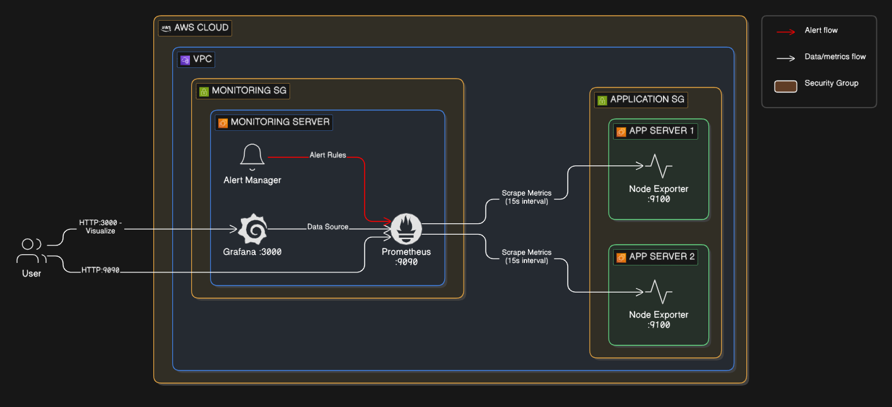
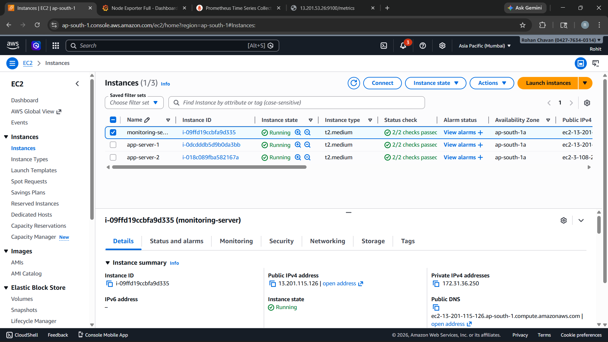
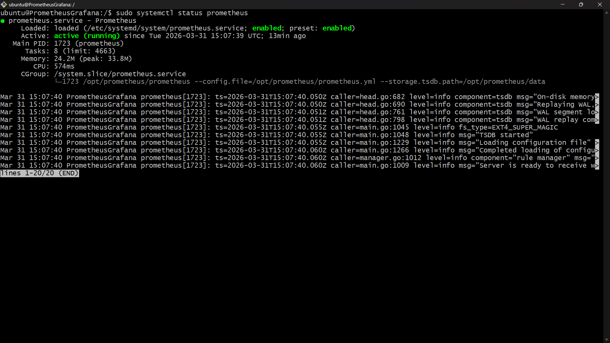
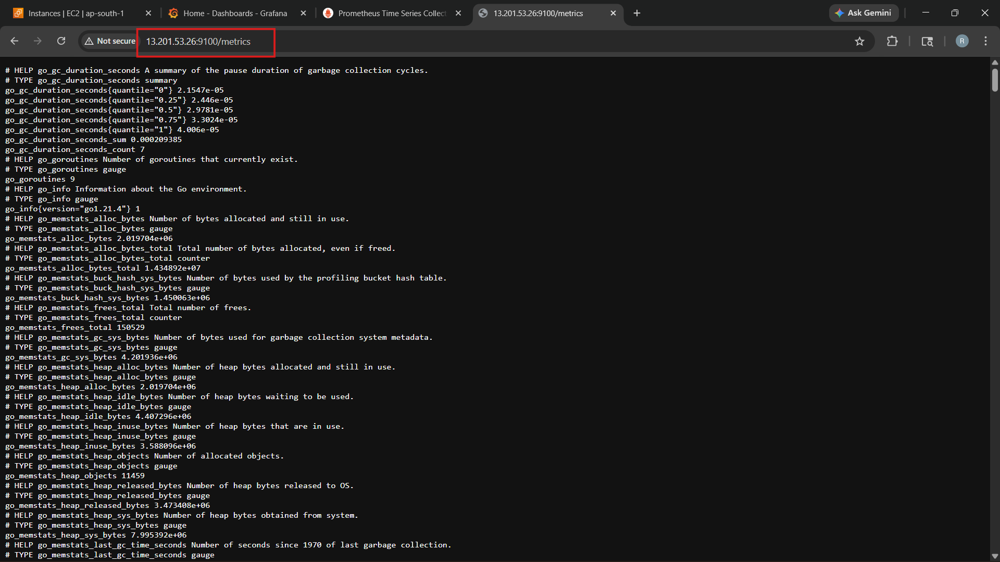
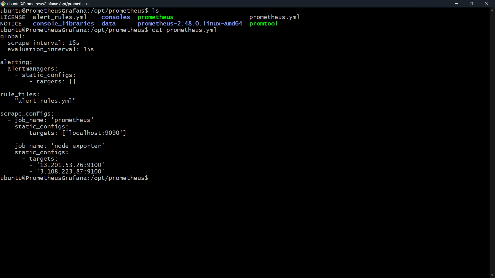
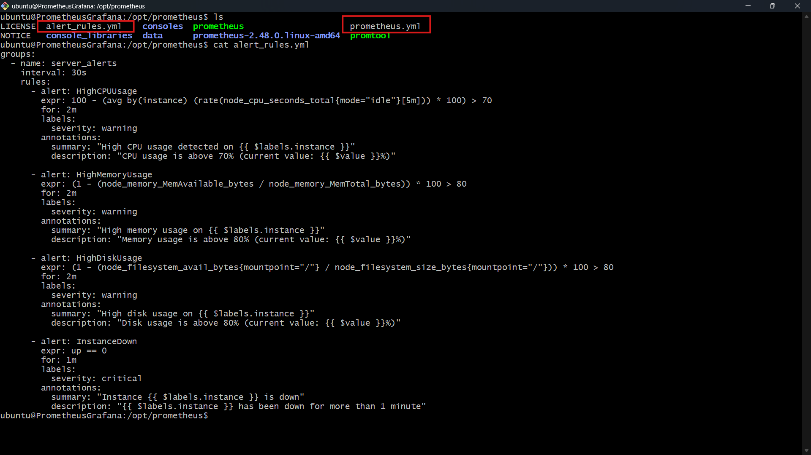
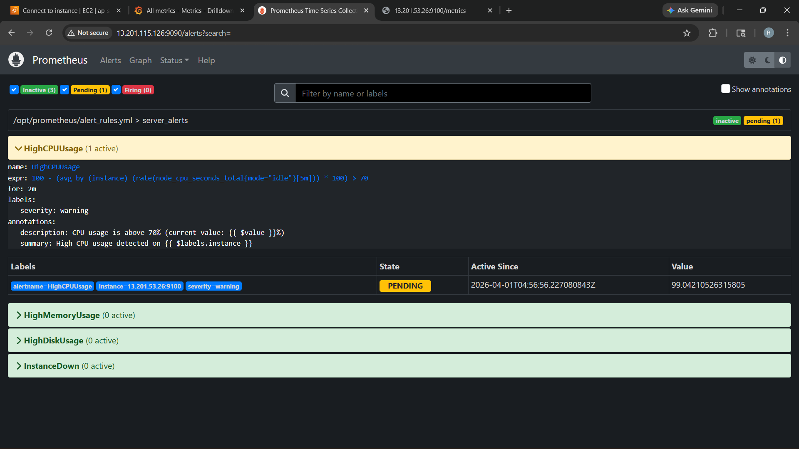
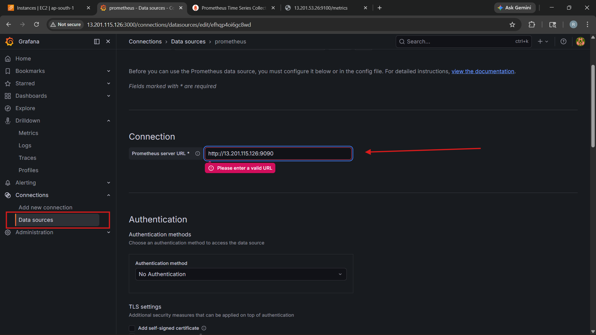
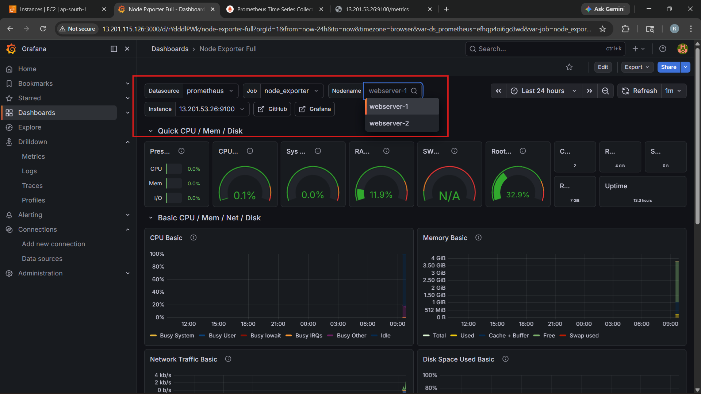
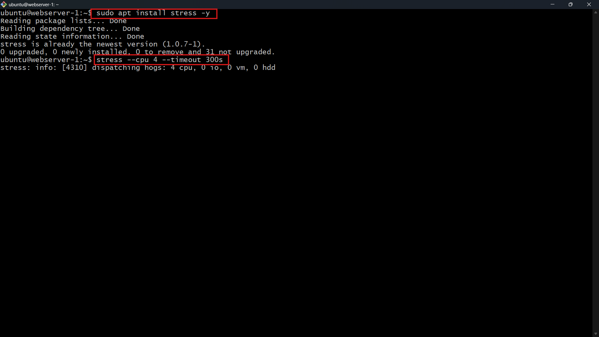

# Real-Time Infrastructure Monitoring and Alerting using Prometheus and Grafana on EC2

## :pushpin: Project Overview
This project implements a comprehensive real-time monitoring solution for EC2 infrastructure using Prometheus and Grafana. The system collects metrics from multiple application servers, aggregates them on a central monitoring server, and provides real-time dashboards with automated alerting capabilities.

##  Architecture



### Components
1. **Monitoring Server** - Central server running Prometheus and Grafana
2. **Application Servers** (2x) - Target servers with Node Exporter for metrics collection
3. **Prometheus** - Metrics collection and storage
4. **Grafana** - Visualization and dashboards
5. **Node Exporter** - System metrics exporter

### Monitoring Pipeline
```
Application Servers (Node Exporter) → Prometheus (Scraping & Storage) → Grafana (Visualization)
                                            ↓
                                      Alert Rules
```

## :dart: Project Objective
As a Site Reliability Engineer, the goal was to implement real-time monitoring dashboards and alerting to proactively detect issues before downtime occurs, replacing manual SSH checks for CPU, memory, and disk usage.

##  Prerequisites
- AWS Account with EC2 access
- SSH key pair for EC2 instances
- Basic knowledge of Linux commands
- Understanding of Prometheus and Grafana

## :rocket: Deployment Steps

### Step 1: Launch EC2 Instances on AWS Console

#### Monitoring Server
1. Logged into AWS Console → EC2 → Launch Instance
2. **Configuration**:
   - **Name**: Monitoring-Server
   - **AMI**: Ubuntu 22.04 LTS (ami-07216ac99dc46a187)
   - **Instance Type**: t2.medium
   - **Key Pair**: Selected existing SSH key
   - **Security Group**: Created new security group with ports:
     - Port 22 (SSH)
     - Port 9090 (Prometheus)
     - Port 3000 (Grafana)
3. Launched the instance

#### Application Servers
Repeated the above process twice to create App-Server-1 and App-Server-2:
- **Instance Type**: t2.medium
- **AMI**: Ubuntu 22.04 LTS
- **Security Group**: Created with ports:
  - Port 22 (SSH)
  - Port 9100 (Node Exporter)

  

### Step 2: Install Prometheus and Grafana on Monitoring Server

```bash
# SSH into monitoring server
ssh -i your-key.pem ubuntu@<monitoring-server-ip>

# Update system
sudo apt-get update -y
sudo apt-get install -y wget

# Download and install Prometheus
cd /tmp
wget https://github.com/prometheus/prometheus/releases/download/v2.48.0/prometheus-2.48.0.linux-amd64.tar.gz
tar xvfz prometheus-2.48.0.linux-amd64.tar.gz
sudo mv prometheus-2.48.0.linux-amd64 /opt/prometheus

# Create Prometheus systemd service
sudo tee /etc/systemd/system/prometheus.service > /dev/null <<EOF
[Unit]
Description=Prometheus
After=network.target

[Service]
User=root
ExecStart=/opt/prometheus/prometheus --config.file=/opt/prometheus/prometheus.yml --storage.tsdb.path=/opt/prometheus/data
Restart=always

[Install]
WantedBy=multi-user.target
EOF

# Start Prometheus
sudo systemctl daemon-reload
sudo systemctl start prometheus
sudo systemctl enable prometheus

# Install Grafana
sudo mkdir -p /etc/apt/keyrings/
wget -q -O - https://apt.grafana.com/gpg.key | gpg --dearmor | sudo tee /etc/apt/keyrings/grafana.gpg > /dev/null
echo "deb [signed-by=/etc/apt/keyrings/grafana.gpg] https://apt.grafana.com stable main" | sudo tee /etc/apt/sources.list.d/grafana.list
sudo apt-get update -y
sudo apt-get install -y grafana

# Start Grafana
sudo systemctl start grafana-server
sudo systemctl enable grafana-server
```


### Step 3: Install Node Exporter on Application Servers

```bash
# SSH into each application server
ssh -i your-key.pem ubuntu@<app-server-ip>

# Download and install Node Exporter
cd /tmp
wget https://github.com/prometheus/node_exporter/releases/download/v1.7.0/node_exporter-1.7.0.linux-amd64.tar.gz
tar xvfz node_exporter-1.7.0.linux-amd64.tar.gz
sudo mv node_exporter-1.7.0.linux-amd64/node_exporter /usr/local/bin/

# Create systemd service
sudo tee /etc/systemd/system/node_exporter.service > /dev/null <<EOF
[Unit]
Description=Node Exporter
After=network.target

[Service]
User=root
ExecStart=/usr/local/bin/node_exporter

[Install]
WantedBy=multi-user.target
EOF

# Start Node Exporter
sudo systemctl daemon-reload
sudo systemctl start node_exporter
sudo systemctl enable node_exporter
```
---
### see the node_exporter matrics ----> Node_exporter-1 orNode_exporter-1<public_ip>:9100


### Step 4: Configure Prometheus

Created Prometheus configuration file at `/opt/prometheus/prometheus.yml`:

```yaml
global:
  scrape_interval: 15s
  evaluation_interval: 15s

alerting:
  alertmanagers:
    - static_configs:
        - targets: []

rule_files:
  - "alert_rules.yml"

scrape_configs:
  - job_name: 'prometheus'
    static_configs:
      - targets: ['localhost:9090']

  - job_name: 'node_exporter'
    static_configs:
      - targets: 
        - '<app-server-1-ip>:9100'
        - '<app-server-2-ip>:9100'
```



### Step 5: Configure Alert Rules

Created alert rules file at `/opt/prometheus/alert_rules.yml`:

```yaml
groups:
  - name: server_alerts
    interval: 30s
    rules:
      - alert: HighCPUUsage
        expr: 100 - (avg by(instance) (rate(node_cpu_seconds_total{mode="idle"}[5m])) * 100) > 70
        for: 2m
        labels:
          severity: warning
        annotations:
          summary: "High CPU usage detected"

      - alert: HighMemoryUsage
        expr: (1 - (node_memory_MemAvailable_bytes / node_memory_MemTotal_bytes)) * 100 > 80
        for: 2m
        labels:
          severity: warning

      - alert: HighDiskUsage
        expr: (1 - (node_filesystem_avail_bytes{mountpoint="/"} / node_filesystem_size_bytes{mountpoint="/"})) * 100 > 80
        for: 2m
        labels:
          severity: warning
```



Restarted Prometheus to apply changes:
```bash
sudo systemctl restart prometheus
```

### Step 6: Configure Grafana

1. Accessed Grafana at `http://<monitoring-server-ip>:3000`
2. Logged in with default credentials (admin/admin)
3. Added Prometheus as data source:
   - Configuration → Data Sources → Add Prometheus
   - URL: `http://localhost:9090`
   - Saved and tested connection

4. Imported Node Exporter Full dashboard:
   - Dashboards → Import → Dashboard ID: 1860
   - Selected Prometheus data source
   - Imported dashboard

## :bar_chart: Monitoring Dashboards

### Prometheus Targets
All targets are successfully being scraped and showing UP status:


### Prometheus Alerts
Configured alert rules are loaded and monitoring:



### Grafana Dashboard
 
 To add a Prometheus data source in Grafana, go to Settings → Data Sources → Add Prometheus → enter URL **(http://Prometheus public_ip:9090)** and click Save & Test.



Node Exporter Full dashboard displaying real-time metrics:




## 🔔 Alert Testing

### Testing High CPU Usage Alert

To test the CPU alert, I SSH'd into one of the application servers and generated CPU load:

```bash
# SSH to application server
ssh -i your-key.pem ubuntu@<app-server-ip>

# Install stress tool
sudo apt-get update
sudo apt-get install -y stress

# Generate CPU load (70%+ for 5 minutes)
stress --cpu 4 --timeout 300s
```

After 2 minutes, the alert triggered successfully:



### Alert Verification Steps
1. Opened Prometheus alerts page: `http://<monitoring-ip>:9090/alerts`
2. Observed alert state transition: **Inactive → Pending → Firing**
3. Alert fired when CPU usage exceeded 70% threshold
4. Alert automatically resolved after stopping the stress test


##  Key Metrics Monitored

### CPU Metrics
- CPU usage per core
- Idle time percentage
- System and user time

### Memory Metrics
- Total memory
- Available memory
- Memory utilization percentage
- Cached and buffered memory

### Disk Metrics
- Disk space used and available
- Disk usage percentage per mount point
- I/O operations

### Network Metrics
- Bytes sent and received
- Network packets
- Network errors

### System Metrics
- System load average (1m, 5m, 15m)
- System uptime
- Number of processes

##  Technologies & Tools Used

- **AWS EC2** - Cloud infrastructure
- **Ubuntu 22.04 LTS** - Operating system
- **Prometheus v2.48.0** - Metrics collection and alerting
- **Grafana** - Visualization and dashboards
- **Node Exporter v1.7.0** - System metrics exporter
- **Systemd** - Service management

##  Project Structure

```
.
├── configs/
│   ├── prometheus.yml               # Prometheus configuration
│   └── alert_rules.yml              # Alert rules configuration
├── img/
│   ├── prometheus_targets.png       # Targets screenshot
│   ├── prometheus_alerts.png        # Alerts screenshot
│   ├── grafana_dashboard.png        # Dashboard screenshot
│   ├── alert_firing.png             # Alert firing screenshot
│   ├── prometheus_config.png        # Config file screenshot
│   └── alert_rules_config.png       # Alert rules screenshot
└── README.md                        # This file
```

## :white_check_mark: Deliverables Checklist

-  Prometheus configuration file
-  Alert rules configuration (CPU > 70%)
-  Grafana dashboard screenshots
-  Alert firing demonstration
-  Complete documentation with monitoring pipeline explanation

##  Troubleshooting

### Prometheus Not Scraping Targets
```bash
# Check Prometheus logs
sudo journalctl -u prometheus -f

# Verify configuration
sudo nano /opt/prometheus/prometheus.yml

# Restart service
sudo systemctl restart prometheus
```

### Node Exporter Not Running
```bash
# Check service status
sudo systemctl status node_exporter

# View logs
sudo journalctl -u node_exporter -n 50

# Restart service
sudo systemctl restart node_exporter
```

### Grafana Dashboard Not Loading
```bash
# Check Grafana status
sudo systemctl status grafana-server

# View logs
sudo journalctl -u grafana-server -f

# Restart Grafana
sudo systemctl restart grafana-server
```

##  Security Considerations

### Security Groups Configuration
- **Monitoring Server**:
  - Port 22: Restricted to specific IP ranges
  - Port 9090: Open for Prometheus access
  - Port 3000: Open for Grafana access

- **Application Servers**:
  - Port 22: Restricted to specific IP ranges
  - Port 9100: Open for Node Exporter metrics

### Best Practices Implemented
- Used SSH key-based authentication
- Configured minimal required ports in security groups
- Regular system updates applied
- Service-specific user accounts created
- Firewall rules configured

##  Monitoring Best Practices

1. **Alert Thresholds**: Set based on baseline metrics analysis
2. **Alert Duration**: Used 2-minute duration to avoid false positives
3. **Dashboard Organization**: Grouped related metrics together
4. **Data Retention**: Configured appropriate retention policies
5. **Regular Reviews**: Scheduled weekly dashboard reviews

##  Key Learnings

1. **Proactive Monitoring**: Real-time dashboards enable quick issue detection
2. **Alert Configuration**: Proper threshold setting prevents alert fatigue
3. **Scalability**: Easy to add more servers to monitoring
4. **Visualization**: Grafana provides excellent metric visualization
5. **Automation**: Systemd services ensure automatic restart on failure

## Access Information

- **Prometheus**: `http://<monitoring-server-ip>:9090`
- **Grafana**: `http://<monitoring-server-ip>:3000`
  - Default Username: `admin`
  - Default Password: `admin` (changed on first login)

##  Cleanup

To remove all resources:
1. Terminate EC2 instances from AWS Console
2. Delete security groups
3. Remove any associated EBS volumes
4. Clean up elastic IPs if assigned

##  Additional Resources

- [Prometheus Documentation](https://prometheus.io/docs/)
- [Grafana Documentation](https://grafana.com/docs/)
- [Node Exporter Metrics](https://github.com/prometheus/node_exporter)
- [PromQL Query Examples](https://prometheus.io/docs/prometheus/latest/querying/examples/)

##  Project Outcome

Successfully implemented a comprehensive monitoring solution that:
-  Monitors multiple EC2 servers in real-time
-  Provides visual dashboards for CPU, memory, and disk metrics
-  Triggers alerts when thresholds are exceeded
-  Enables proactive issue detection before downtime
-  Replaces manual SSH-based monitoring with automated solution

---

**Project completed successfully with all deliverables met. The monitoring stack is now operational and actively monitoring infrastructure health.**